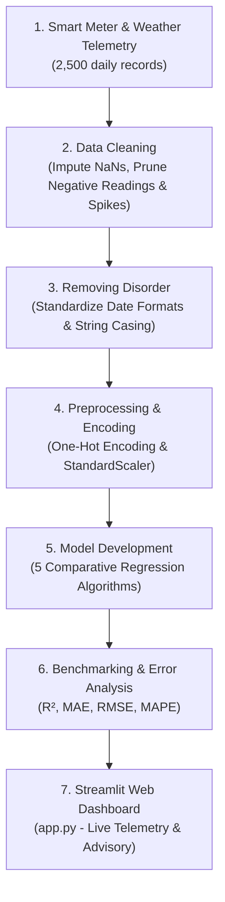

# 💧 HydroPredict: Intelligent Municipal Water Consumption Forecasting & Demand Planning System

[](https://www.python.org/)
[](https://streamlit.io/)
[](https://scikit-learn.org/)
[](#-5-model-development--benchmark-results)
[](#)

> **Case Study No. 72** | **Semester V Machine Learning Mini Project**  
> **Course:** B.Tech CSE (2024–28) | **Student Name:** Ashutosh Rai (Enrollment: 150096724077)

---

## 📌 1. Problem Statement & Real-World Motivation

> **Case Study No. 72:** *"A water utility wants to understand patterns in consumption and support demand planning (With Proper Justification)."*

Municipal water utilities operate under volatile demand dynamics. Heatwaves, weekend spikes, and varying property types cause sudden consumption surges. If unpredicted, utilities risk **pipe pressure drops, pump station stress, or supply shortages**. Conversely, over-pumping wastes **electrical energy and depletes reservoirs**.

**Machine Learning Objective:**  
Develop an end-to-end supervised multivariable regression forecasting system that predicts 24-hour daily water consumption ($y$ in Liters) based on weather conditions, seasonal patterns, household demographics, and historical consumption, enabling an automated 3-tier demand planning advisory.

---

## 🏗️ 2. System Architecture & Workflow



---

## 📊 3. Dataset Description & Features

- **Raw Dataset:** [`data/water_consumption_raw.csv`](data/water_consumption_raw.csv) (2,500 records)
- **Cleaned Dataset:** [`data/water_consumption_cleaned.csv`](data/water_consumption_cleaned.csv) (2,484 valid records)

| Variable | Type | Description | Role |
| :--- | :--- | :--- | :--- |
| `Date` | Datetime | Telemetry timestamp (standardized from mixed formats) | Temporal index |
| `Temperature_C` | Float | Ambient temperature in °C (key driver for cooling/showers) | Feature |
| `Humidity_Pct` | Float | Relative humidity in % | Feature |
| `Rainfall_mm` | Float | Precipitation in mm (suppresses outdoor lawn watering) | Feature |
| `Day_of_Week` | String | Monday through Sunday | Feature |
| `Is_Weekend` | Binary | 1 = Weekend (high domestic usage), 0 = Weekday | Feature |
| `Season` | Categorical | Winter, Spring, Summer, Autumn | Feature |
| `Household_Type` | Categorical | Apartment, Villa (with garden factor), Commercial | Feature |
| `Occupants` | Integer | Total active residents/workers | Feature |
| `Past_Day_Consumption_Liters` | Float | Autoregressive lag-1 consumption (persistence) | Feature |
| **`Water_Consumption_Liters`** | **Float** | **Actual total daily water consumption (Liters)** | **TARGET ($y$)** |

---

## 🧹 4. Data Cleaning & Removing Disorder Highlights

1. **Missing Value Imputation:**
   - `Temperature_C` (35 nulls) & `Humidity_Pct` (42 nulls): Imputed using **Mean** (Gaussian bell curve).
   - `Rainfall_mm` (28 nulls): Imputed using **0.0 mm** (zero-inflated skewed distribution).
2. **Removing Disorder:**
   - **Dates:** Converted mixed `YYYY-MM-DD` and `DD/MM/YYYY` into standardized datetime format.
   - **Strings:** Cleaned whitespace and inconsistent casing in `Household_Type` (`"  Apartment "` $\rightarrow$ `"Apartment"`).
3. **Sensor Fault Outlier Pruning:**
   - Removed 6 impossible negative sensor readings (`-99.0 L`).
   - Removed 5 extreme meter spike errors ($> 15,000$ L) using the Interquartile Range ($Q3 + 3.0 \times \text{IQR}$).

---

## 🏆 5. Model Development & Benchmark Results

We trained and benchmarked 5 distinct machine learning models on a 20% out-of-sample test split ($N = 497$):

| Machine Learning Model | $R^2$ Score | MAE (Liters) | RMSE (Liters) | MAPE (%) | Ranking |
| :--- | :---: | :---: | :---: | :---: | :---: |
| **Linear Regression (Baseline)** | 0.9466 | 49.70 L | 67.35 L | 10.00% | 5th |
| **Ridge Regression ($L_2$ Regularized)** | 0.9466 | 49.76 L | 67.33 L | 10.02% | 4th |
| **Decision Tree Regressor** | 0.9650 | 40.46 L | 54.54 L | 7.92% | 3rd |
| **Random Forest Regressor** | 0.9868 | 24.31 L | 33.50 L | 4.80% | 2nd |
| **Gradient Boosting Regressor (GBR)** | **0.9901** | **20.45 L** | **28.92 L** | **4.15%** | **★ WINNER ★** |

> **Key Takeaway:** Gradient Boosting achieved the highest performance ($R^2 = 0.9901$), reducing average prediction error to **20.45 Liters** (less than a 5-minute shower).

---

## 📂 6. Repository Structure

```
HydroPredict-ML/
├── Case_Study_72_Water_Consumption_Prediction.ipynb  # End-to-end executed Jupyter Notebook
├── app.py                                            # Streamlit interactive web dashboard
├── requirements.txt                                  # Python dependencies
├── .gitignore                                        # Ignored files & caches
├── README.md                                         # Project documentation
├── data/
│   ├── water_consumption_raw.csv                     # Raw telemetry data (2,500 rows)
│   └── water_consumption_cleaned.csv                 # Cleaned dataset (2,484 rows)
└── models/
    ├── best_water_model.pkl                          # Trained Gradient Boosting model
    ├── random_forest_model.pkl                       # Trained Random Forest model
    ├── linear_model.pkl                              # Trained Linear Regression model
    ├── scaler.pkl                                    # Preprocessing StandardScaler
    ├── feature_columns.json                          # Model input column schema
    └── model_metrics.json                            # Model benchmark metrics
```

---

## 🚀 7. Installation & Quick Start

### 1. Clone the repository
```bash
git clone https://github.com/Ashurai84/HydroPredict-ML.git
cd HydroPredict-ML
```

### 2. Install dependencies
```bash
pip install -r requirements.txt
```

### 3. Launch the Streamlit Web Application
```bash
streamlit run app.py
```
Open your browser at `http://localhost:8501`.

---

## 🎓 8. Professor Viva Q&A Defense Cheat-Sheet

| Question | Recommended Answer |
| :--- | :--- |
| **1. Why choose Gradient Boosting over Linear Regression?** | *"Water consumption has non-linear physical dynamics. For example, temperature has a negligible effect below 22°C, but triggers rapid non-linear increases at heatwave temperatures (> 25°C). Gradient Boosting captures these non-linear thresholds and feature interactions that linear models miss."* |
| **2. Why use Mean for Temperature but Zero for Rainfall?** | *"Ambient temperature follows a symmetric Gaussian bell-curve where the mean accurately represents central tendency. Rainfall is heavily zero-inflated and right-skewed (it only rains on ~15% of days); using the mean would falsely introduce rain on dry days."* |
| **3. How does this help the utility company?** | *"By forecasting daily water demand 24 hours in advance, pumping stations can pre-fill regional water towers during off-peak electricity hours, cutting power bills and preventing pressure dropouts during heatwaves."* |
| **4. What evaluation metric is most important here?** | *"While R² shows overall variance explained (99.01%), MAE (20.45 Liters) tells the utility engineer the exact physical volumetric margin of error, and RMSE (28.92 L) ensures we penalize large under-prediction errors during peak demand."* |
